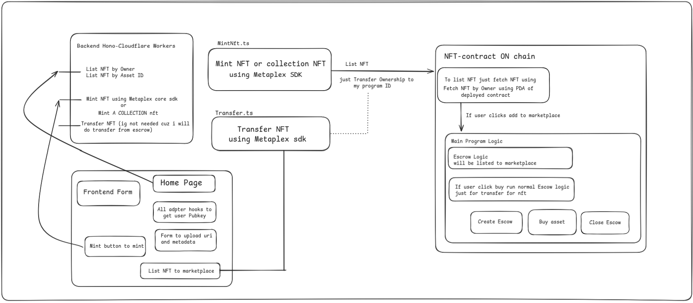

## NFT Marketplace
<p align="center">
  
</p>

## Live Working Demo
You can check out the live demo of the NFT marketplace at the following link:
[Live Demo](https://frontend.ansht.workers.dev/)


## User Story: Mint, List, and Buy NFTs

### 1. Mint an NFT:
- The user uploads their image and details (like title, description) to the platform.
- The system generates an NFT (a unique digital item) based on the uploaded details.

### 2. List an NFT for Sale:
- The user decides to list their minted NFT for sale.
- The user confirms the listing, and the NFT is now available for others to buy.

### 3. Buy an NFT:
- A buyer browses the marketplace and selects an NFT they want to purchase.
- The system processes the payment and transfers the NFT to the buyer.
- The buyer completes the transaction, and the NFT is now in their wallet.
- 
## Architectural Diagram
<p align="center">
  
</p>

A decentralized NFT marketplace on Solana Devnet using Anchor, MPL Core, and Cloudflare Workers.

**Program ID:** 4WyfhmmEu1MoSMDQfiN2JEbQV28gSo6vhm9idEL7ArtG

## Architecture Flow

1. **Minting**:
    - User uploads image and metadata to Irys (decentralized storage) via the Frontend.
    - Frontend sends metadata URI to Backend (`/mint`).
    - Backend creates a mint transaction, signs it with a generated asset signer (partial sign), and returns it.
    - User signs the transaction with their wallet and submits it to Solana.

2. **Listing (Escrow)**:
    - User requests to list an NFT (`/list`).
    - Backend builds a transaction to initialize an Escrow PDA and deposit the NFT into it.
    - User signs and submits. The NFT is now held by the program.

3. **Buying**:
    - Buyer requests to buy an NFT (`/buy`).
    - Backend builds a transaction that transfers SOL to the seller and the NFT to the buyer.
    - Buyer signs and submits. The program validates the trade and executes the atomic swap.

## Tech Stack:
- **Frontend**: React, Vite, TailwindCSS, Shadcn UI.
- **Backend**: Cloudflare Workers (Hono), Metaplex Umi.
- **Blockchain**: Solana (Devnet), Anchor Framework, Metaplex MPL Core.

## Setup Instructions

### 1. Backend Setup (Cloudflare Worker)

```bash
cd workerbackend

bun install
cp .dev.vars.example .dev.vars
bun run dev

```

### 2. Frontend Setup

```bash
cd frontend
bun install
cp .env.example .env
# VITE_SOLANA_RPC_URL="https://devnet.helius-rpc.com/?api-key=YOUR_API_KEY"
bun run dev
```

### 3. Deploy Backend to Cloudflare Workers

```bash
cd workerbackend
npx wrangler secret put SOLANA_RPC_URL
bun run deploy
```

### 4. Update Frontend API URL

After deploying the backend, update `frontend/src/services/api.ts` with your deployed worker URL.

## Important Security Notes

⚠️ **Never commit API keys to git!**

- `.dev.vars` (backend) and `.env` (frontend) are git-ignored
- Only `.dev.vars.example` and `.env.example` are committed (without real keys)
- For production deployment, use Cloudflare secrets (see step 3 above)
