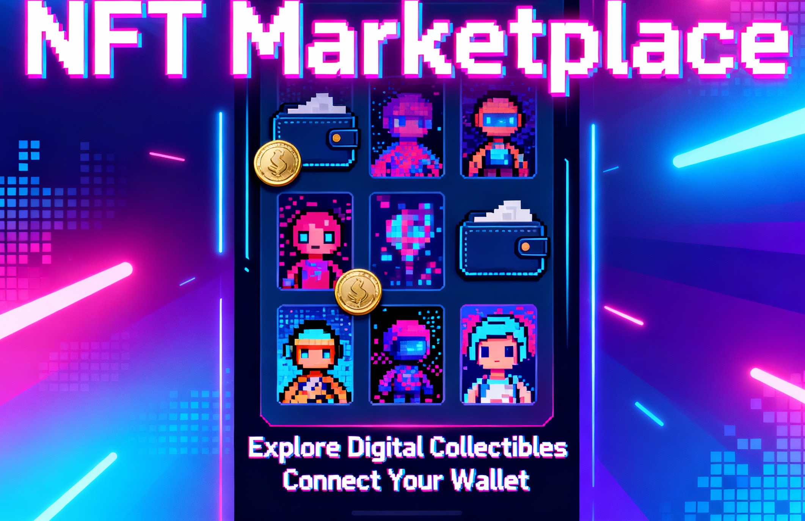

## Kumule — multi-chain NFT marketplace

<p align="center">
  
</p>

One marketplace over two chains: **Solana devnet** (MPL Core, escrow program) and
**Base Sepolia** (ERC-721 + marketplace contract). Testnets only — no real funds.

[Live demo](https://kumele.ansht.workers.dev/) — this is what `frontend/` deploys to.
`frontend.ansht.workers.dev` is a **v1 worker still running**: Solana-only, pointed at the old
backend, and not deployed from this branch.

Prices are native per chain: SOL for Solana listings, ETH for Base ones. No wrapped or
stablecoin pricing, and no cross-chain conversion — a bare number is meaningless across
chains, and the filter UI says so rather than quietly comparing the two.

Money never passes through a float on either side. Amounts move as decimal strings and
base units as `BigInt`, from the chain through the API to the browser.

## Flows

**Mint.** Image goes to R2, then a metadata JSON referencing it, and only then is the mint
transaction built — so a token is never created pointing at a URI that does not resolve.
On Solana the worker builds and the wallet signs; on Base the browser signs directly and
tells the worker to index the token from its own receipt.

**List and buy (Solana).** The worker builds instructions against escrow program
`3ozh4TQJbeyXFUuXsj7fYmHB5aCVkg24cZN5zZmigR44`, whose source is in `programs/`. Listing
moves the asset into an escrow PDA; buying is an atomic swap the program validates.

**List and buy (Base).** Both are wallet-signed in the browser against the marketplace
contract in `contracts-evm/`. The worker only reads.

**Settlement.** Every wallet-signed action ends at `POST /api/settle` with a transaction
hash and never an outcome. The worker verifies the hash on chain, re-reads ownership from
the chain itself, and only then writes the sale. A caller cannot report a sale that did
not happen or a token they do not hold.

## Stack

- **Frontend** — React 19, Vite, Tailwind v4, wagmi + viem, Solana wallet-adapter
- **Backend** — Cloudflare Workers (Hono), Prisma over Neon Postgres, R2 for assets
- **Chains** — Anchor + MPL Core on Solana devnet, Foundry contracts on Base Sepolia

`ARCHITECTURE.md` has the data flows, schema, route map and file layout.

## Setup

```bash
cd workerbackend
npm install --legacy-peer-deps    # umi's peer ranges conflict; npm ci will not resolve
cp .dev.vars.example .dev.vars    # DATABASE_URL and ADMIN_API_KEY are the only required ones
npm run dev                       # :8787
```

```bash
cd frontend
npm install --legacy-peer-deps
cp .env.example .env              # every value is optional; defaults hit the deployed API
npm run dev                       # :5173
```

Before trusting any change:

```bash
cd workerbackend && npm run check   # typecheck + bundle + every unit check
cd frontend && npm run build
```

`npm run check` includes `wrangler deploy --dry-run`. Skipping it is how a branch with a
clean typecheck and green tests stayed undeployable for twenty commits.

## Deploy

```bash
cd workerbackend && npm run deploy
cd frontend && npm run deploy
```

Set secrets with `npx wrangler secret put NAME`. `workerbackend/.dev.vars.example` lists
every variable the worker reads, which are required, and what happens when each is unset.

## Security notes

- `.dev.vars` and `.env` are git-ignored; only the `.example` files are committed
- Admin routes return 503 until `ADMIN_API_KEY` is set — there is no fallback key
- The admin key is held in component state in the browser, never `localStorage`
- Devnet and testnet only. Nothing here is configured for mainnet.
